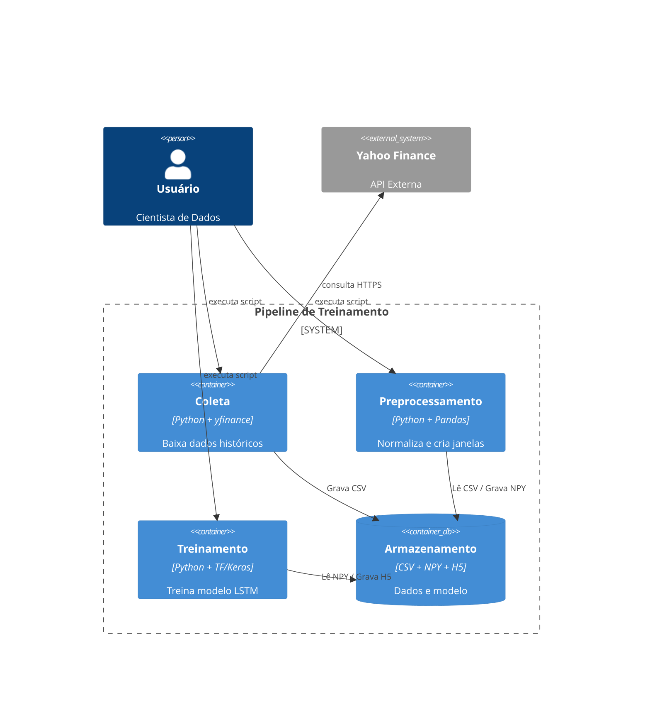
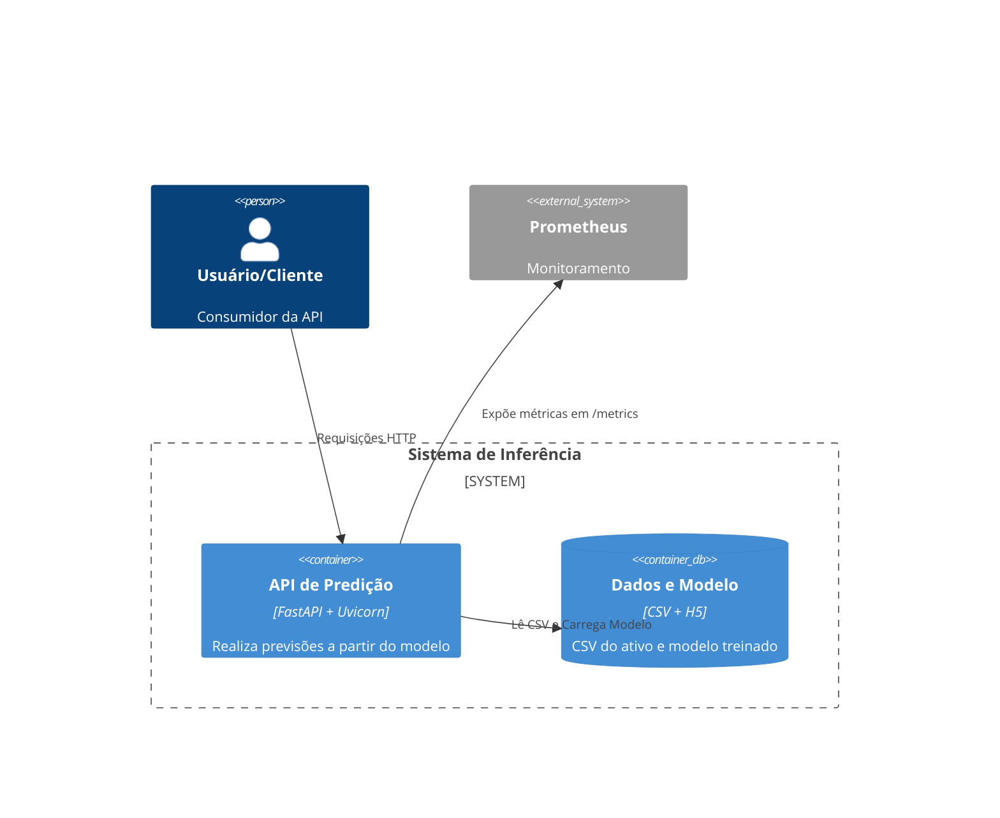

# Stock Prediction - Pipeline de Previsão de Preços

Este projeto implementa um **pipeline completo de Machine Learning para previsão de preços de ações**, abrangendo todas as etapas do ciclo de vida de um modelo preditivo: **coleta de dados, pré-processamento, treinamento, avaliação e disponibilização de inferência via API REST**.

A solução utiliza as seguintes tecnologias:

- **yfinance** para coleta de dados históricos de mercado  
- **TensorFlow/Keras** para construção e treinamento do modelo baseado em **LSTM (Long Short-Term Memory)**  
- **FastAPI** para disponibilização das previsões em uma API REST  
- **Docker** para empacotamento, reprodutibilidade e execução da aplicação em qualquer ambiente  

O modelo de rede neural LSTM é treinado utilizando séries temporais do preço de fechamento de uma ação específica, permitindo capturar padrões temporais e dependências sequenciais nos dados financeiros.

## Funcionamento da Solução

A arquitetura do projeto segue um **modelo desacoplado por ativo**, onde **cada ação possui seu próprio ciclo completo de treinamento e uma imagem Docker dedicada**. O funcionamento ocorre da seguinte forma:

1. **Seleção de um único ativo**  
   Um ativo específico (ex: `PETR4.SA`) é escolhido para o processo.

2. **Coleta dos dados históricos**  
   Os dados são baixados via `yfinance` e armazenados em formato `.csv`.

3. **Pré-processamento e Treinamento**  
   - Os dados são normalizados  
   - As janelas temporais (window size) são geradas  
   - O modelo LSTM é treinado exclusivamente para esse ativo  

4. **Geração da Imagem Docker dedicada**  
   - O modelo treinado (`.h5`)  
   - Os arquivos de dados (`.csv`, `.npy`)  
   - A API de inferência  

   são empacotados **em uma única imagem Docker específica para aquele ativo**.

5. **Disponibilização via API REST**  
   A imagem gerada expõe o endpoint `/predict`, permitindo a realização de inferências apenas para o ativo utilizado no treinamento.

Caso seja necessário realizar previsões para outro ativo, basta repetir o pipeline:

> **baixar o novo CSV → treinar novamente → gerar uma nova imagem Docker dedicada**.

## Visão de Arquitetura

A seguir são apresentados os diagramas de arquitetura da solução. Os diagramas seguem o padrão **C4 Model**, facilitando a compreensão dos componentes, suas responsabilidades e o fluxo de dados entre eles, tanto no processo de treinamento quanto na fase de inferência.

### Pipeline de Treinamento

Representa o fluxo de coleta, preparação dos dados, treinamento do modelo e geração da imagem Docker.



### API de Inferência + Monitoramento

Representa a execução do modelo já treinado em produção, expondo os endpoints da API para consumo externo.



## Avaliação do Modelo

O modelo de previsão é avaliado durante a etapa de treinamento utilizando métricas de regressão adequadas para séries temporais, incluindo:

- **MAE (Mean Absolute Error)** – erro absoluto médio das previsões  
- **RMSE (Root Mean Square Error)** – penaliza erros maiores de forma mais severa  
- **MAPE (Mean Absolute Percentage Error)** – erro percentual médio em relação ao valor real  

Essas métricas permitem avaliar a precisão do modelo sob diferentes perspectivas, oferecendo uma visão clara da qualidade das previsões.

Durante o treinamento, os valores dessas métricas são exibidos diretamente no console, permitindo o acompanhamento da evolução do modelo ao longo das épocas.

Além disso, as métricas também são expostas na aplicação em produção através do endpoint `/metrics`

## Preparação do Ambiente

### 1. Criar e ativar o ambiente virtual

``` bash
python3 -m venv .venv
source .venv/bin/activate
```

### 2. Instalar dependências

``` bash
pip install -r requirements.txt
```

## Criação dos arquivos CSV & Pré-Processamento

1. Coleta de dados históricos

    ``` bash
    #   PETR4.SA      -> Código do ativo no Yahoo Finance
    #   2015-01-01    -> Data inicial da série histórica (YYYY-MM-DD)
    #   2024-01-01    -> Data final da série histórica  (YYYY-MM-DD)
    python src/collector/fetch_yfinance.py PETR4.SA 2015-01-01 2024-01-01
    ```

    Saída esperada:

        data/current.csv

2. Normalização / Limpeza do CSV

    Antes do pré-processamento, garantimos que o CSV está limpo e no formato esperado (Date,Open,High,Low,Close,Adj Close,Volume).

    ```bash
    python src/preprocessing/preprocess.py data/current.csv
    ```

    Saída esperada:

        data/X.npy
        data/y.npy
        data/current.csv

## Treinamento do Modelo

O treinamento do modelo é realizado a partir do arquivo CSV previamente gerado e pré-processado, que contém a série histórica do ativo escolhido.

```bash
python src/models/train.py
```
Durante o treinamento, o modelo é avaliado utilizando métricas de erro como MAE (Mean Absolute Error), RMSE (Root Mean Square Error) e MAPE (Mean Absolute Percentage Error).

Os hiperparâmetros do modelo (tamanho da janela temporal, número de neurônios da LSTM, taxa de aprendizado e número de épocas) foram definidos de forma empírica, a partir de testes experimentais comparando o desempenho por meio das métricas de validação. A configuração final adotada foi a que apresentou menor erro médio absoluto no conjunto de validação.

## Criação e execução da Imagem Docker

### 1. Criar a imagem

``` bash
docker build -t stock-predict-api .
```

### 2. Executar o container

``` bash
docker run -p 8080:80 \
  -v ./data/current.csv:/app/data/current.csv:Z \
  stock-predict-api
```

O arquivo CVS utilizado para treinamento já é incluído na imagem, no entanto uma versão mais recente pode ser mapeada utilizando o argumento `-v`

### 3. Testar a API

O endpoint /health verifica o estado da aplicação

``` bash
curl http://localhost:8080/health
```
O endpoint /predict gera uma previsão com base no conteúdo atual do arquivo data/current.csv

```bash
curl http://localhost:8080/predict
```

O endpoint /metrics segue o padrão de métricas do Prometheus, permitindo integração direta com ferramentas de observabilidade.

```bash
curl http://localhost:8080/metrics
```
